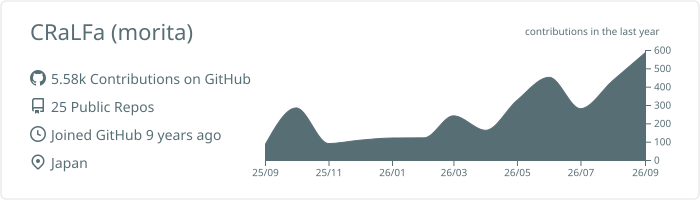
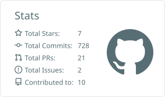
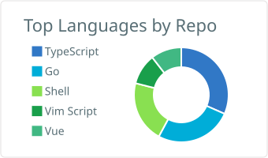
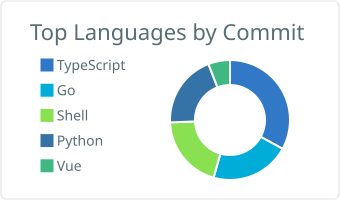
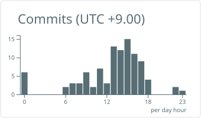
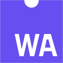

### Hey👋, I'm CRaLFa

I love [Go](https://go.dev/), [TypeScript](https://www.typescriptlang.org/) and [Vim](https://www.vim.org/).

- Software engineer in Japan
- Building bots (Discord / Slack / LINE) and small web apps
- Vim plugin author (vim9-img-search)
- WSL2 & PowerShell user

<picture><source media="(prefers-color-scheme: dark)" srcset="https://github-readme-stats-fast.vercel.app/api/top-langs/?username=CRaLFa&hide=html%2Ccss&layout=compact&theme=github_dark" /></picture>
<picture><source media="(prefers-color-scheme: dark)" srcset="https://github-readme-stats-fast.vercel.app/api?username=CRaLFa&show_icons=true&count_private=true&theme=github_dark" /></picture>

## <picture><source media="(prefers-color-scheme: dark)" srcset="icons/person-24-dark.svg" /></picture> Status

<a href="https://github.com/vn7n24fzkq/github-profile-summary-cards"><picture><source media="(prefers-color-scheme: dark)" srcset="profile-summary-card-output/github_dark/0-profile-details.svg" /></picture></a>
<a href="https://github.com/vn7n24fzkq/github-profile-summary-cards"><picture><source media="(prefers-color-scheme: dark)" srcset="profile-summary-card-output/github_dark/3-stats.svg" /></picture></a>
<a href="https://github.com/vn7n24fzkq/github-profile-summary-cards"><picture><source media="(prefers-color-scheme: dark)" srcset="profile-summary-card-output/github_dark/1-repos-per-language.svg" /></picture></a>
<a href="https://github.com/vn7n24fzkq/github-profile-summary-cards"><picture><source media="(prefers-color-scheme: dark)" srcset="profile-summary-card-output/github_dark/2-most-commit-language.svg" /></picture></a>
<a href="https://github.com/vn7n24fzkq/github-profile-summary-cards"><picture><source media="(prefers-color-scheme: dark)" srcset="profile-summary-card-output/github_dark/4-productive-time.svg" /></picture></a>

## <picture><source media="(prefers-color-scheme: dark)" srcset="icons/browser-16-dark.svg" /></picture> Web apps

<a href="https://github.com/CRaLFa/google-maps-restaurant-list-finder"><picture><source media="(prefers-color-scheme: dark)" srcset="https://github-readme-stats-fast.vercel.app/api/pin/?username=CRaLFa&repo=google-maps-restaurant-list-finder&theme=github_dark" /></picture></a>
<a href="https://github.com/CRaLFa/image-manipulation"><picture><source media="(prefers-color-scheme: dark)" srcset="https://github-readme-stats-fast.vercel.app/api/pin/?username=CRaLFa&repo=image-manipulation&theme=github_dark" /></picture></a>

<a href="https://github.com/CRaLFa/nanikiru"><picture><source media="(prefers-color-scheme: dark)" srcset="https://github-readme-stats-fast.vercel.app/api/pin/?username=CRaLFa&repo=nanikiru&theme=github_dark" /></picture></a>
<a href="https://github.com/CRaLFa/rw-swarm-post"><picture><source media="(prefers-color-scheme: dark)" srcset="https://github-readme-stats-fast.vercel.app/api/pin/?username=CRaLFa&repo=rw-swarm-post&theme=github_dark" /></picture></a>

<a href="https://github.com/CRaLFa/twi-fav"><picture><source media="(prefers-color-scheme: dark)" srcset="https://github-readme-stats-fast.vercel.app/api/pin/?username=CRaLFa&repo=twi-fav&theme=github_dark" /></picture></a>
<a href="https://github.com/CRaLFa/stamp-downloader"><picture><source media="(prefers-color-scheme: dark)" srcset="https://github-readme-stats-fast.vercel.app/api/pin/?username=CRaLFa&repo=stamp-downloader&theme=github_dark" /></picture></a>

## <picture><source media="(prefers-color-scheme: dark)" srcset="icons/dependabot-16-dark.svg" /></picture> Bots

<a href="https://github.com/CRaLFa/slack-gemini-bot"><picture><source media="(prefers-color-scheme: dark)" srcset="https://github-readme-stats-fast.vercel.app/api/pin/?username=CRaLFa&repo=slack-gemini-bot&theme=github_dark" /></picture></a>
<a href="https://github.com/CRaLFa/gc-notifier"><picture><source media="(prefers-color-scheme: dark)" srcset="https://github-readme-stats-fast.vercel.app/api/pin/?username=CRaLFa&repo=gc-notifier&theme=github_dark" /></picture></a>

<a href="https://github.com/CRaLFa/tdnet-bot"><picture><source media="(prefers-color-scheme: dark)" srcset="https://github-readme-stats-fast.vercel.app/api/pin/?username=CRaLFa&repo=tdnet-bot&theme=github_dark" /></picture></a>
<a href="https://github.com/CRaLFa/nikkei-bot"><picture><source media="(prefers-color-scheme: dark)" srcset="https://github-readme-stats-fast.vercel.app/api/pin/?username=CRaLFa&repo=nikkei-bot&theme=github_dark" /></picture></a>

<a href="https://github.com/CRaLFa/pr-times-bot"><picture><source media="(prefers-color-scheme: dark)" srcset="https://github-readme-stats-fast.vercel.app/api/pin/?username=CRaLFa&repo=pr-times-bot&theme=github_dark" /></picture></a>

##  Vim plugins

<a href="https://github.com/CRaLFa/vim9-img-search"><picture><source media="(prefers-color-scheme: dark)" srcset="https://github-readme-stats-fast.vercel.app/api/pin/?username=CRaLFa&repo=vim9-img-search&theme=github_dark" /></picture></a>
<a href="https://github.com/CRaLFa/vim-img-search"><picture><source media="(prefers-color-scheme: dark)" srcset="https://github-readme-stats-fast.vercel.app/api/pin/?username=CRaLFa&repo=vim-img-search&theme=github_dark" /></picture></a>

##  WebAssembly

<a href="https://github.com/CRaLFa/wasm-WebGL"><picture><source media="(prefers-color-scheme: dark)" srcset="https://github-readme-stats-fast.vercel.app/api/pin/?username=CRaLFa&repo=wasm-WebGL&theme=github_dark" /></picture></a>

## <picture><source media="(prefers-color-scheme: dark)" srcset="icons/terminal-16-dark.svg" /></picture> CLI

<a href="https://github.com/CRaLFa/bash-scripts"><picture><source media="(prefers-color-scheme: dark)" srcset="https://github-readme-stats-fast.vercel.app/api/pin/?username=CRaLFa&repo=bash-scripts&theme=github_dark" /></picture></a>
<a href="https://github.com/CRaLFa/pwsh-scripts"><picture><source media="(prefers-color-scheme: dark)" srcset="https://github-readme-stats-fast.vercel.app/api/pin/?username=CRaLFa&repo=pwsh-scripts&theme=github_dark" /></picture></a>

<a href="https://github.com/CRaLFa/dict"><picture><source media="(prefers-color-scheme: dark)" srcset="https://github-readme-stats-fast.vercel.app/api/pin/?username=CRaLFa&repo=dict&theme=github_dark" /></picture></a>
<a href="https://github.com/CRaLFa/comchat"><picture><source media="(prefers-color-scheme: dark)" srcset="https://github-readme-stats-fast.vercel.app/api/pin/?username=CRaLFa&repo=comchat&theme=github_dark" /></picture></a>

## <picture><source media="(prefers-color-scheme: dark)" srcset="icons/package-16-dark.svg" /></picture> Others

<a href="https://github.com/CRaLFa/ranaIntroPanel"><picture><source media="(prefers-color-scheme: dark)" srcset="https://github-readme-stats-fast.vercel.app/api/pin/?username=CRaLFa&repo=ranaIntroPanel&theme=github_dark" /></picture></a>
<a href="https://github.com/CRaLFa/md-parser"><picture><source media="(prefers-color-scheme: dark)" srcset="https://github-readme-stats-fast.vercel.app/api/pin/?username=CRaLFa&repo=md-parser&theme=github_dark" /></picture></a>

<a href="https://github.com/CRaLFa/dotfiles"><picture><source media="(prefers-color-scheme: dark)" srcset="https://github-readme-stats-fast.vercel.app/api/pin/?username=CRaLFa&repo=dotfiles&theme=github_dark" /></picture></a>

### Language

### Editor

### OS

### Frameworks

### Infrastructure

### Dev tools

